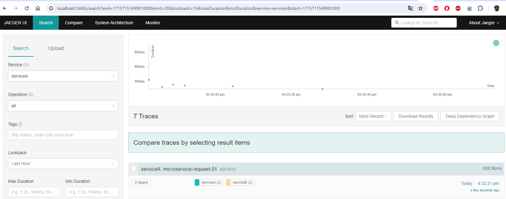
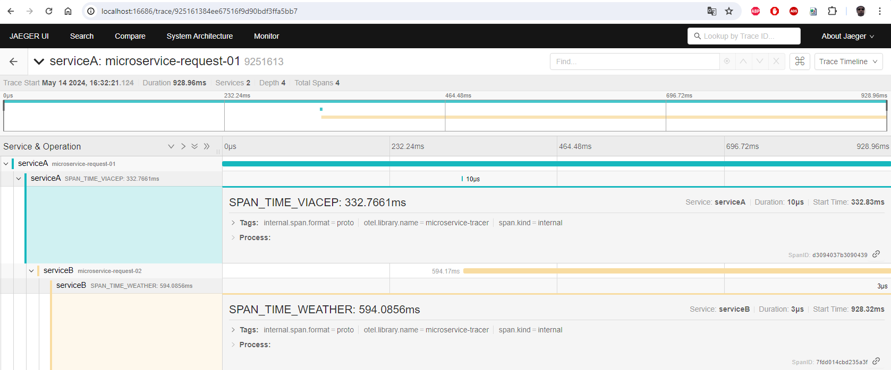
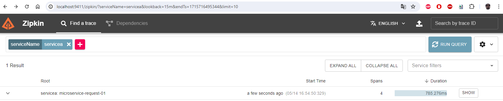
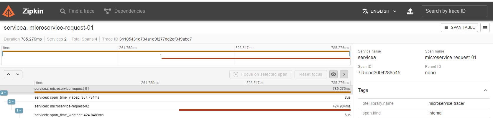

## Dêe uma estreal! :star:
Se vc gostou do projeto temperature-system-by-cep-otel, por favor dêe uma estrela

## Como executar:
Execute o comando docker-compose:  
docker-compose up -d

Caso desejar rodar local execute no prompt de comando na pasta raiz:  
go run ./cmd/serverA/main.go  
go run ./cmd/serverB/main.go  

Vai ser necessário também descomentar as linhas 'local' nos arquivos:  
./cmd/serverA/main.go  
./cmd/serverB/main.go  
./internal/application/infra/web/handler_service_a.go  

Instale o 'REST Client' no 'VS Code' e execute o teste da pasta:  
./api/api.http  

Url jaeger:  
http://localhost:16686/  

Url zipkin:  
http://localhost:9411/

## Imagens:

Imagens dos spans no 'jaeger' e 'zipkin'.  

  

  

  

  

## Tecnologias implementadas:

go 1.20
 - Router [chi](https://github.com/go-chi/chi)
 - Opentelemetry [otel](https://opentelemetry.io/docs/languages/go/getting-started/)
 - Opentelemetry - Span [otel-span](https://opentelemetry.io/docs/languages/go/instrumentation/#creating-spans)
 - Opentelemetry - Collector[otel-collector](https://opentelemetry.io/docs/collector/quick-start/)
 - Zipkin [zipkin] (https://zipkin.io/)
 - Prometheus
 - Jaeger
 